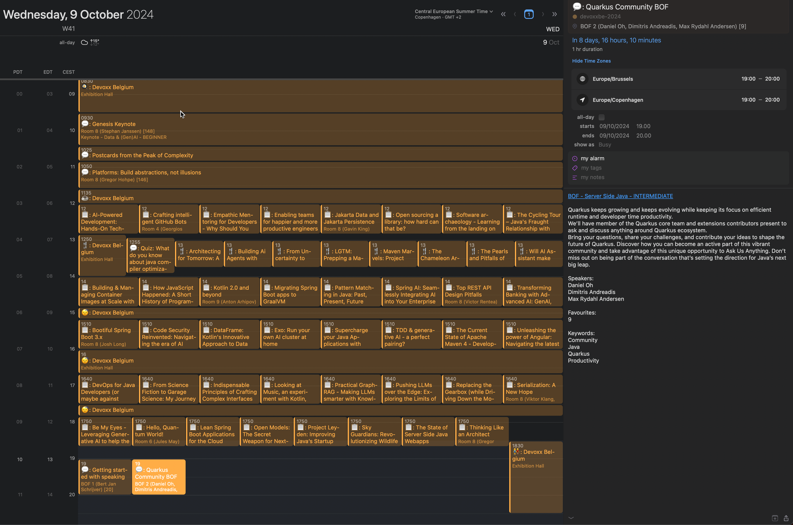

= Devoxx Belgium to .ics

This is a simple repo that has a script that converts Devoxx.be schedule into a .ics file that
can be imported into your favourite calendar.

[NOTE]
====
This comes with no warranty. It works for me and I'm sharing it in case it helps someone else.
====

== Usage

The file `devoxxbe-2024.ics` is a .ics file containing the schedule for Devoxx Belgium 2024.

You can generate your own or you can use the following URL to import into your favourite calendar app or Google Calendar: https://raw.githubusercontent.com/maxandersen/cfpdev2ics/refs/heads/main/devoxxbe-2024.ics

[WARNING]
====
Just be warned that Google Calendar is not consistent with updates/refresh.
====

I currently update it whenever I feel like it. It has stable UUIDs for each event so it should,
in theory, keep any notes/tags you made yourself in your calendar app.

== How it works

Run the following command to generate the .ics file:

[source,bash]
----
jbang cfpdev2ics.java
----

You can use `-o otherfile.ics` to specify an alternative output file.

It will only update if the rest endpoint report changes. Use `-f` to force an update.

== How it is done

The file `cfpdev2ics.java` is a JBang script that accesses the Devoxx REST API to get the schedule and then
converts it to .ics format.

It is using https://quarkus.io/guides/rest-client[Quarkus's `@RestClient`] to access the API and then https://github.com/mangstadt/biweekly[biweekly] to convert the data to .ics format.

Then a github action setup to regenerate and commit the `.ics`` file when changes are detected.

== Ideas

- [x] Could be nice to use GitHub action to automatically update the file when changes are detected.
- [ ] Could add simple filters to make it easier to limit to only include your favourite talks/speakers.